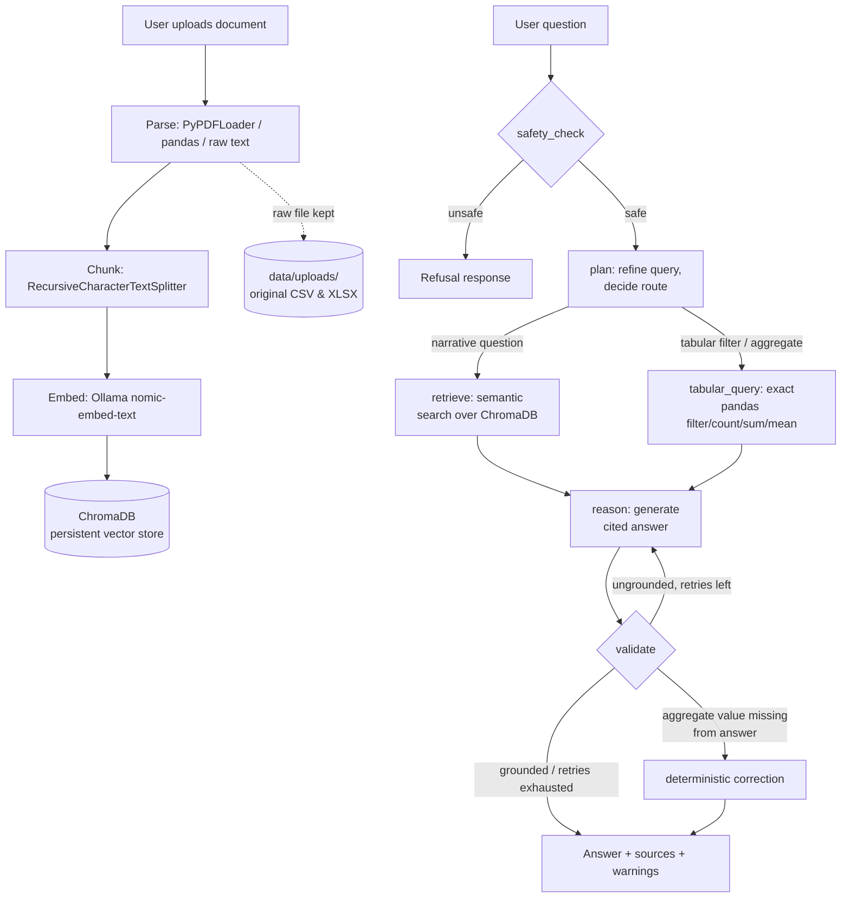

# Enterprise GenAI Doc Assistant — Project Documentation

## 1. Overview

The Enterprise GenAI Doc Assistant is a Generative AI + RAG + Agentic AI system that lets users upload enterprise documents (PDF, TXT, CSV, XLSX), ask natural-language questions about them, and receive grounded, cited answers. It is built around an explicit multi-step agent — implemented as a LangGraph state machine — that plans, retrieves, reasons, and validates before returning an answer, running entirely on local models via Ollama.

**Goals demonstrated by this project:**
- End-to-end document ingestion across four formats
- Semantic retrieval via a persistent vector database (ChromaDB)
- Agentic orchestration: planning, tool selection, reasoning, and self-validation
- Reliability mechanisms: input-safety guardrails, groundedness checking, deterministic correction of LLM arithmetic errors
- A REST API (FastAPI) and a web UI (Streamlit), containerized for deployment

## 2. High-Level Architecture

```
Upload (PDF/TXT/CSV/XLSX)
      |
Parse & extract text (per-format loaders)
      |
Chunk (RecursiveCharacterTextSplitter)
      |
Embed (Ollama: nomic-embed-text)
      |
Store (ChromaDB, persistent)   +   raw file kept in data/uploads/ (for exact structured queries)
      |
Question -> [safety_check] -> [plan] -+-> [retrieve]       (semantic search)      -+-> [reason] -> [validate] -> answer + sources
                  |                    |                                          |        |
              reject unsafe            +-> [tabular_query]  (exact pandas filter/  +   ungrounded -> retry reason (max 1x)
              input -> refusal             count/sum/mean over the source CSV/XLSX)     else -> abstain
```



## 3. Technology Stack

| Layer | Technology | Why |
|---|---|---|
| REST API | FastAPI + Uvicorn | Async, typed, auto-generated Swagger docs |
| Web UI | Streamlit | Fast to build a chat + upload interface without a separate frontend stack |
| Agent orchestration | LangGraph (`StateGraph`) | Explicit, inspectable state machine rather than an opaque agent loop — each step (plan/retrieve/reason/validate) is a visible node with typed state |
| LLM (chat/reasoning) | Ollama, `llama3.2:3b` | Runs fully locally, no API cost/key. Sized to fit this machine's 4GB-VRAM GPU (see §11, Design Decisions) |
| Embeddings | Ollama, `nomic-embed-text` | Local embedding model, 768-dim, small footprint |
| Vector store | ChromaDB (`PersistentClient`) | Local, persistent, simple metadata filtering |
| Document parsing | `langchain_community.PyPDFLoader` (PDF), `pandas` (CSV/XLSX), stdlib (TXT) | Standard, well-supported loaders per format |
| Structured data queries | `pandas.DataFrame.query()` | Exact, deterministic filtering/aggregation over tabular data — see §7 |
| Config | `pydantic-settings` | Typed, env-driven configuration (`.env`) |
| Testing | `pytest` | Unit coverage for pure-function logic (chunking) |
| Deployment | Docker + Docker Compose | Reproducible container deployment for the app tier |

## 4. Component Breakdown

```
app/
  main.py                   FastAPI app: lifespan startup (creates data dirs), mounts the router
  core/
    config.py                pydantic-settings: all env-driven configuration, cached via get_settings()
    schemas.py                Pydantic request/response models for the API
    llm_client.py             Cached singletons for the Ollama chat model & embeddings client; health check
  services/
    ingestion_service.py      Per-format parsing (PDF/TXT/CSV/XLSX) -> chunk -> embed -> store; entrypoint for uploads
    chunking_service.py       Pure text-splitting logic (no I/O), independently unit-testable
    vector_store_service.py   ChromaDB wrapper: add/query/list/delete against the persistent collection
    tabular_query_service.py  Loads the raw uploaded CSV/XLSX and runs an exact pandas filter/aggregate query
  agents/
    orchestrator.py           Builds and compiles the LangGraph StateGraph; the sole entrypoint `run_agent()`
    planner.py                Refines the question into a search query; decides semantic vs. structured routing
    retriever_agent.py        Semantic search over ChromaDB, exposed as a LangChain @tool
    tabular_agent.py          Structured filter/count/sum/mean query, exposed as a LangChain @tool
    reasoner.py                Builds the grounded-answer prompt and calls the LLM
    validator.py               Deterministic aggregate correction + lexical groundedness check + retry/abstain logic
  utils/
    guardrails.py              Pure functions: input-safety checks, groundedness heuristic
  api/routes/routes.py         FastAPI endpoints: /health-check, /upload-documents, /ask-question
streamlit_app/app.py          Chat + upload UI, calls the FastAPI backend over HTTP
```

## 5. System Setup

**Prerequisites:** Python 3.12+, [Ollama](https://ollama.com). Docker + Docker Compose optional (for containerized deployment, §10).

1. Install Ollama and pull the two local models used by this project:
   ```
   ollama pull llama3.2:3b
   ollama pull nomic-embed-text
   ```
   Ensure Ollama is running (tray app, or `ollama serve`) before starting the backend.
2. Create a virtualenv and install dependencies:
   ```
   python -m venv venv
   venv\Scripts\pip install -r requirement.txt
   ```
3. Copy `.env.example` to `.env` (defaults already match local Ollama; edit only if you changed model names/ports).
4. Run the backend: `venv\Scripts\python -m uvicorn app.main:app --reload`
5. In a second terminal, run the UI: `venv\Scripts\python -m streamlit run streamlit_app/app.py --server.baseUrlPath doc-assistant`
6. Open http://localhost:8501/doc-assistant — upload a document, ask a question. Sanity check anytime at http://localhost:8000/health-check.

(Full walkthrough, troubleshooting, and the Docker path are in `README.md` and §10 below.)

## 6. Agent Roles & The Agentic Workflow (LangGraph)

The orchestrator (`app/agents/orchestrator.py`) defines a typed `AgentState` (a `TypedDict`) that flows through the graph, accumulating fields as each node runs. It is compiled once (`@lru_cache`) and re-invoked per question.

**Nodes:**

| Node | File | Responsibility |
|---|---|---|
| `safety_check` | `utils/guardrails.py` | Rejects empty/oversized input, prompt-injection patterns (e.g. "ignore all previous instructions"), and a basic unsafe-keyword list |
| `plan` | `agents/planner.py` | Refines the question into a search query, and decides whether to route to semantic search or the structured table tool. The LLM proposes a plan via structured output, but a small local model is unreliable at writing correct query syntax or setting routing flags — so deterministic regex/schema matching (comparison operators, categorical value lookup against the actual table, aggregate keyword detection) overrides or backs up the LLM's own fields for the common cases |
| `retrieve` | `agents/retriever_agent.py` | Semantic similarity search against ChromaDB — used for narrative/document text |
| `tabular_query` | `agents/tabular_agent.py`, `services/tabular_query_service.py` | Exact filter/count/sum/mean over the real uploaded CSV/XLSX via `pandas.DataFrame.query()` — used instead of semantic search when the question needs precise filtering or aggregation |
| `reason` | `agents/reasoner.py` | Builds a numbered-context prompt (citation markers `[1]`, `[2]`, …) and calls the LLM for a grounded answer |
| `validate` | `agents/validator.py` | Two checks, in order: (1) if the tabular tool computed an exact aggregate, verify that value literally appears in the answer — correct it deterministically if not; (2) otherwise check lexical groundedness against retrieved chunks, retry `reason` once if ungrounded, then fall back to an explicit abstention |

**Edges:**

```
START -> safety_check -> (unsafe: END with refusal)
                       -> (safe: plan)
plan -> (tabular routing signal: tabular_query) -> reason
plan -> (narrative question: retrieve) -> reason
reason -> validate -> (ungrounded & retries left: back to reason)
                    -> (grounded, or aggregate corrected, or retries exhausted: END)
```

`run_agent(question, top_k)` is the single function the API layer calls; it invokes the graph and maps the final state into the `AskQuestionResponse` returned to the client.

## 7. Why Two Retrieval Tools?

Semantic vector search retrieves by *meaning*, not by evaluating conditions. A question like *"employees whose salary is more than 100000"* has no reliable relationship to embedding distance — the retriever will confidently return some rows that don't satisfy the condition and miss others that do, because "closeness in embedding space" isn't the same as "satisfies a numeric filter." This was discovered directly during testing: with only semantic search, the same salary question returned an incomplete and partially wrong list.

The fix is architectural, not a prompt tweak: the agent has a second tool, `tabular_query`, that runs the filter/aggregate directly against the real data with pandas — guaranteeing correctness for that class of question — while semantic search continues to handle narrative/unstructured document text. The planner decides which tool to use per question.

## 8. Reliability & Guardrails

- **Input safety** (`safety_check` node): rejects empty/oversized questions, common prompt-injection phrasings, and a basic unsafe-content keyword list before any retrieval happens.
- **Groundedness check** (`validate` node): after the LLM answers, the answer's sentences are checked for lexical word-overlap against the retrieved context; an explicit "I don't have enough information" abstention is always treated as valid (not a failure) rather than penalized.
- **Bounded retry**: if the answer is judged ungrounded, the reasoner is re-invoked once with stricter instructions before the system falls back to an explicit abstention — it never silently returns an unverified answer after exhausting retries.
- **Deterministic aggregate correction**: small local LLMs occasionally recompute a count/sum/average instead of citing the exact value the tabular tool already calculated, and get the arithmetic wrong. Rather than trusting the model, the validator checks whether the exact computed value is present in the answer text and overwrites the answer with a correct, deterministically-generated statement if not.
- **Structured-query sandboxing**: query expressions are restricted to pandas' `DataFrame.query()` boolean-expression grammar (not arbitrary Python), and a regex blocklist rejects tokens like `__`, `import`, `exec(`, `os.`, `subprocess` as defense-in-depth before any expression is evaluated.
- **Temperature = 0**: the chat model runs at zero sampling temperature — for a fact-lookup assistant that must cite sources, deterministic output is strictly preferable to creative variation, and it measurably improved answer consistency during testing (see §11).

## 9. API Reference

| Endpoint | Method | Description |
|---|---|---|
| `/health-check` | GET | Reports backend status, Ollama reachability, and Chroma readiness |
| `/upload-documents` | POST (multipart `files`) | Parses, chunks, embeds, and indexes one or more PDF/TXT/CSV/XLSX files; returns per-file status and chunk counts |
| `/ask-question` | POST (`{"question": "...", "top_k": 4}`) | Runs the full agent pipeline; returns `{answer, sources, is_grounded, warnings}` |

Interactive Swagger docs are available at `/docs` once the backend is running.

## 10. Deployment Steps

**Local (native)** — see §5 System Setup above for the full sequence.

**Docker** (backend + UI containerized; Ollama stays native on the host — GPU passthrough into Docker on Windows would need WSL2 + the NVIDIA Container Toolkit, unnecessary when Ollama already has native GPU support):

1. Install Ollama and pull the models on the host (§5, step 1); make sure it's running.
2. From the project root: `docker compose up --build`
3. Open http://localhost:8501/doc-assistant. Backend at http://localhost:8000 (`/docs` for Swagger).
4. Stop with `docker compose down` — `data/` is bind-mounted, so uploads and the Chroma DB persist across restarts.

The backend reaches host-side Ollama via `http://host.docker.internal:11434`, confirmed working during testing. If it can't connect, Ollama may be bound to `127.0.0.1` only — set `OLLAMA_HOST=0.0.0.0` in the Ollama environment and restart it. The frontend container reaches the backend container via the Compose network (`http://backend:8000`), not `localhost`.

## 11. Design Decisions & Challenges Faced During Development

Real pivots made during development — each one was a working assumption that testing proved wrong, not a design choice made in the abstract:

- **LLM provider — Anthropic API considered, then Ollama chosen.** The user has a Claude subscription but not separate Anthropic API billing; Ollama (local, free) was used instead, with `langchain-ollama` for both chat and embeddings.
- **Challenge: GPU out-of-memory.** The original plan picked `llama3.1:8b` partly for reliable native tool-calling. Loading it crashed with a CUDA OOM error — this machine's GPU (GTX 1650) only has 4GB VRAM. Since the implementation invokes tools manually (not via the LLM's own function-calling), model size mattered more than tool-calling support — swapped to `llama3.2:3b` (~2GB), which fits comfortably.
- **Agent framework — LangChain + LangGraph**, chosen over hand-rolled orchestration for an explicit, inspectable state graph that maps cleanly onto separate planner/retriever/reasoner/validator files.
- **Challenge: small-model non-determinism.** At temperature 0.1, the model's structured-output routing decisions and short-list answers were inconsistent run-to-run — e.g. sometimes dropping a correct row from a 4-item list, or leaving a query expression empty. Setting temperature to 0 made both routing and answer generation fully deterministic across repeated runs with identical input.
- **Challenge: semantic search gives wrong answers on tabular filter/aggregate questions.** Discovered via direct user testing: asking "employees whose salary is more than 100000" against an uploaded CSV returned an incomplete, partially wrong list, because vector similarity has no relationship to numeric conditions — it retrieves by meaning, not by evaluating a filter. Fixed architecturally by adding a second agent tool, `tabular_query`, that runs the filter/aggregate directly against the real data with pandas (see §7), plus a planner that routes each question to the right tool.
- **Challenge: the small model's own structured-output for the tabular tool was unreliable** — it sometimes left the query expression empty, wrote pseudo-SQL instead of pandas syntax, or mis-set the routing flag for questions unrelated to the table (e.g. a bare "how many" in a narrative question about a policy document wrongly triggered the CSV tool). Fixed with a deterministic layer: regex-based comparison/aggregate-keyword detection plus a lookup against the table's actual categorical values, used to override or backstop the LLM's own fields rather than trusting them outright.
- **Challenge: the model ignored an exact computed number and recomputed it wrong.** Even when the tabular tool calculated an exact aggregate (e.g. an average) and the prompt explicitly said "use this value, don't recompute it," the model sometimes did the arithmetic itself anyway — and got it wrong. Fixed by having the validator check whether the exact computed value is present in the final answer and deterministically override it if not, rather than relying further on prompting.

## 12. Testing

Automated: `pytest tests/` covers `chunking_service` (pure function, no Ollama dependency).

Manual end-to-end verification performed during development:
- Upload → index → grounded Q&A with correct citations (PDF/TXT/CSV)
- Abstention on out-of-scope questions (no hallucinated answer)
- Refusal on prompt-injection input
- Structured filter questions (e.g. "salary more than 100000") — verified against hand-computed expected results
- Structured aggregate questions (count / average) — verified against hand-computed expected results
- Full pipeline re-verified against the containerized (Docker) deployment, confirming identical results to the native run

## 13. Known Limitations

- Guardrails use lexical-overlap heuristics and a keyword/regex blocklist, not a dedicated safety model — adequate for a capstone demo, not production-hardened.
- Single ChromaDB collection shared across all uploaded documents; no per-user or per-session isolation.
- No authentication on the API — intended for local/demo use.
- The tabular tool's deterministic query-building (regex-based comparison/categorical/aggregate detection) covers common single-condition questions well; more complex multi-clause questions (e.g. combining a comparison, a category filter, and an aggregate in one question) rely more heavily on the LLM's own structured output and are less consistently reliable.
- A 3B-parameter local model, even at temperature 0, has a lower ceiling on complex multi-step reasoning than a larger hosted model — this is a deliberate trade-off for zero API cost and full local execution.
